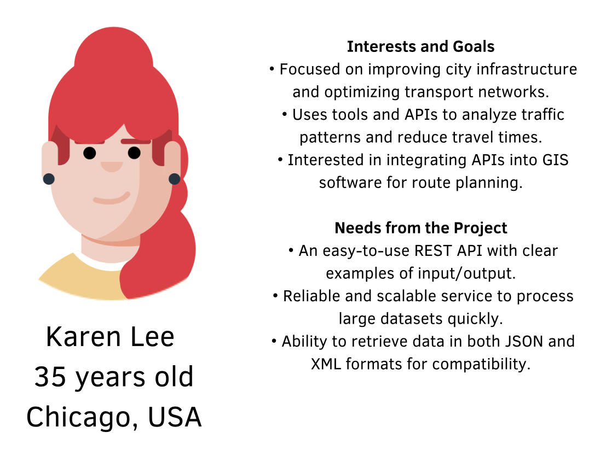

# Functional specifications

## Project Roles
| Picture | Full name       | Role               | Description | Links                                                             |
| ----- | --------------- | ------------------------ |------| ----------------------------------------------------------------- |
|  | Evan UHRING | Project manager | Monitor the project's timeline and goals. Main coordinator between stakeholders and the team.|[LinkedIn](https://www.linkedin.com/in/evan-uhring-72911b293/) [GitHub](https://github.com/Evan-UHRING) |
|  | Manech LAGUENS | Program manager | Makes sure the project meets expectation. Is responsible for writing the Functional Specifications| [LinkedIn](https://www.linkedin.com/in/manech-laguens-020127293/) [GitHub](https://github.com/Manech-Laguens)  |
|  | Enzo GUILLOUCHE | Tech lead| Makes the technical decision in the project. Translates the Functional Specification into Technical Specifications. Does code review.| [LinkedIn](https://www.linkedin.com/in/enzoguillouche/) [GitHub](https://github.com/EnzoGuillouche) |
|  | Pavlo PRENDI | Software engineer|Writes and tests code to implement project features. Participates in documentation and technical design discussions. | [LinkedIn](https://www.linkedin.com/in/pavlo-prendi-674777309/) [GitHub](https://github.com/PavloPrendi) |
|  | Mariem ZAIANE | Software engineer| | [LinkedIn](https://www.linkedin.com/in/mariem-zaiane-2b2165225/) [GitHub](https://github.com/Mariem-Zaiane) |
|  | Maxime THIZEAU | Quality assurance|Tests the product to identify and document bugs and issues. Creates test plans and verifies that fixes are implemented correctly. | [LinkedIn](https://www.linkedin.com/in/maxime-thizeau-0b311a293/) [GitHub](https://github.com/MaximeTAlgosup) |
|  | Aurélien FERNANDEZ | Tech writer | Creates the user manual. Ensures all materials are clear and easy to understand for end users. |[LinkedIn](https://www.linkedin.com/in/aurélien-fernandez-4971201b8/) [GitHub](https://github.com/aurelienfernandez) |
## Glossary
|Therm Used | Definition|
|--------|---------|
| ddd | dddd
## Functional Requirements 

## Project Overview

### **Project Definition**

#### **Objectives**
- Develop a software solution to calculate the quickest path between two landmarks in the United States.
- Show functionality via a REST API supporting both JSON and XML response formats.
- Ensure the solution is optimized for a large-scale dataset (24 million nodes) and meets performance goals. 

#### **Scope**
| **In Scope**                                                                 | **Out of Scope**                                                                 |
| ---------------------------------------------------------------------------- | -------------------------------------------------------------------------------- |
| Implementing shortest-path calculation using efficient algorithms (e.g., A*). | Real-time updates to the dataset during API operation.                           |
| Creating a REST API with endpoints to look for the shortest paths.                  | User interface or front-end application for end-users.                          |
| Dataset validation to ensure graph integrity and connectivity.               | Advanced visualization tools or external database integration.                  |

#### **Deliverables**
| **Name**                       | **Type**               | **Deadline**           |
| ------------------------------ | ---------------------- | ---------------------- |
| Functional Specifications Document | Documentation         | February 7th 2025         |
| Technical Specification Document | Documentation | February 7th 2025 |
|Management Documents | Documentation | February 7th 2025 |
| C++ Source Code                | Fully commented code   | February 7th 2025         |
| REST API Implementation        | API supporting JSON/XML| February 7th 2025         |
| Dataset Validation Tool        | Standalone utility     | February 7th 2025         |
| Test Suite                     | Comprehensive tests and test plan  | February 7th 2025         |
| Oral Presentation | Presentation | February 14th 2025 |

---

## **Functional Requirements**

### **Core Functional Requirements**
1. **Shortest Path Calculation**
   - Input: IDs of source and destination landmarks.
   - Output:
     - Total travel time as an integer.
     - Ordered list of landmarks in the computed path.

2. **REST API**
   - **Endpoint:** `GET /path`
   - **Parameters:**
     - `source_id`: Starting landmark ID.
     - `destination_id`: Destination landmark ID.
   - **Response Formats:**
     - JSON:
       ```json
       {
         "time": 35,
         "path": ["101", "205", "303"]
       }
       ```
     - XML:
       ```xml
       <response>
         <time>35</time>
         <path>
           <landmark>101</landmark>
           <landmark>205</landmark>
           <landmark>303</landmark>
         </path>
       </response>
       ```

3. **Dataset Validation**
   - Ensure the graph forms a Directed Acyclic Graph (DAG).
   - Verify that the graph is fully connected (all nodes are reachable).

4. **Performances**
   - Query responses must be generated in less than 1 second.
   - Approximation of the result shouldn't exceed 10% deviation from the shortest possible duration.


## **Available Resources**


- **Total Hours:** 264 hours available to complete the project (from January 6 to February 7).
- **Team Members:** One computer per team member.
- **Mentorship:** Support from Georgios Tsatiris, our computer science teacher.
---

### **Learning Resources**
To have a better understanding of C++, data structures, algorithms, and REST API development, the following resources were given to the students:

#### **Videos:**
1. [C++ Full Course - Beginner to Advanced](https://youtu.be/1v_4dL8l8pQ?si=CV35wdEOx1KCl-E3)  
   - A comprehensive guide to learning C++ from scratch.
2. [Introduction to Data Structures](https://youtu.be/wN0x9eZLix4?si=rBOmrNonypEmn5Kx)  
   - A beginner-friendly overview of data structures.
3. [Data Structures and Algorithms in C++](https://youtu.be/8hly31xKli0?si=xUAj3fC6d9h0oKAm)  
   - Focused on practical implementations in C++.

#### **Articles:**
1. [An Open Guide to Data Structures and Algorithms](https://open.umn.edu/opentextbooks/textbooks/an-open-guide-to-data-structures-and-algorithms)  
   - A free textbook for learning and reference.
2. [REST API Introduction - GeeksforGeeks](https://www.geeksforgeeks.org/rest-api-introduction/)  
   - Explains the basics of REST API and its use cases.
3. [Building RESTful APIs with C++](https://medium.com/@AlexanderObregon/building-restful-apis-with-c-4c8ac63fe8a7)  
   - Step-by-step guide to implementing REST APIs in C++.


## **Personas**




<!-- thats one example, if yall like them i'll do two more -->